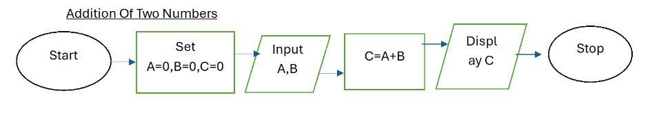
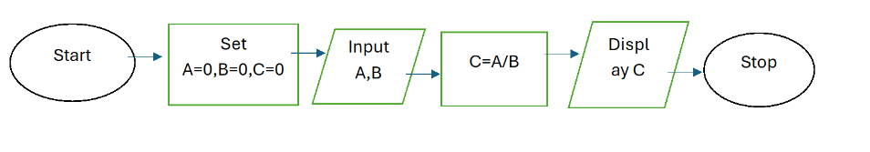
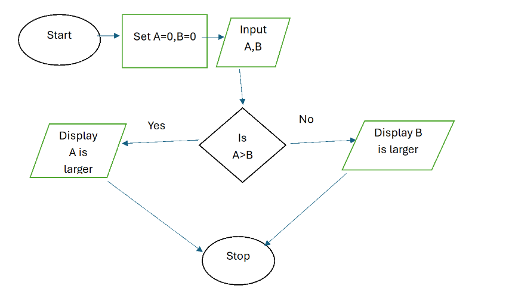

# 1.2 What are Flowcharts?

Back to [Home](../../README.md)

A flowchart is simply a graphical representation of steps. It shows steps in sequential order and is widely used in presenting the flow of algorithms, workflow or processes. Typically, a flowchart shows the steps as boxes of various kinds, and their order by connecting them with arrows.

# Study Material

> 1. <https://www.visual-paradigm.com/tutorials/flowchart-tutorial/>

# Knowledge Check

**Exercise 1**

### Addition of Two numbers

**Exercise 2**

### Division

**Exercise 3**

### Greater Number

